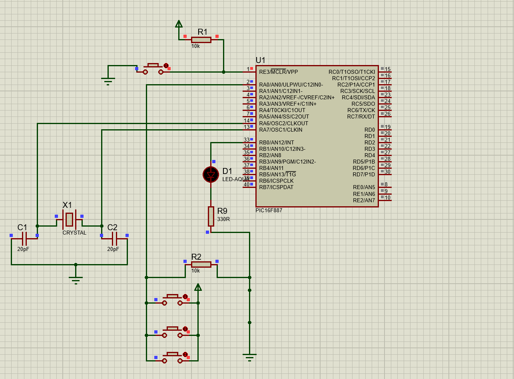

# **LED Control with 3 Buttons on PIC16F887**

This project demonstrates how to control an LED using 3 buttons connected to a PIC16F887 microcontroller. The LED toggles its state (ON/OFF) each time any of the buttons is pressed. The buttons are connected to the same input pin (RA0), and the LED is connected to RB0.

## **Circuit Description**

### Circuit
  

### **Components Used**
- **Microcontroller**: PIC16F887
- **LED**: Connected to RB0
- **Buttons**: 3 buttons connected to RA0
- **Resistors**:
  - 330 ohms for the LED current limiting.
  - 10 kΩ pull-up resistor for the buttons.

## Repository Structure

The repository contains the following files:
1. **Circuit Diagram**: `screen/LED_3_button.png`  
   - A visual representation of the circuit designed in Proteus ISIS.
2. **Proteus Project File**: `1_led_3_button.pdsprj`  
   - The Proteus ISIS project file for simulating the circuit.
3. **mikroC Code**: `tp3_2_buttons_2_LED.c`  
   - The mikroC source code for the PIC16F887 microcontroller.

## Instructions
1. Open the `1_led_3_button.pdsprj` file to view the circuit setup.
2. Load `tp3_2_buttons_2_LED.c` into MikroC and compile it to generate the hex file.
3. Upload the hex file to the microcontroller in Proteus.
4. Run the simulation to observe the LED blinking.

## Tools
- MikroC Pro for PIC
- Proteus ISIS

